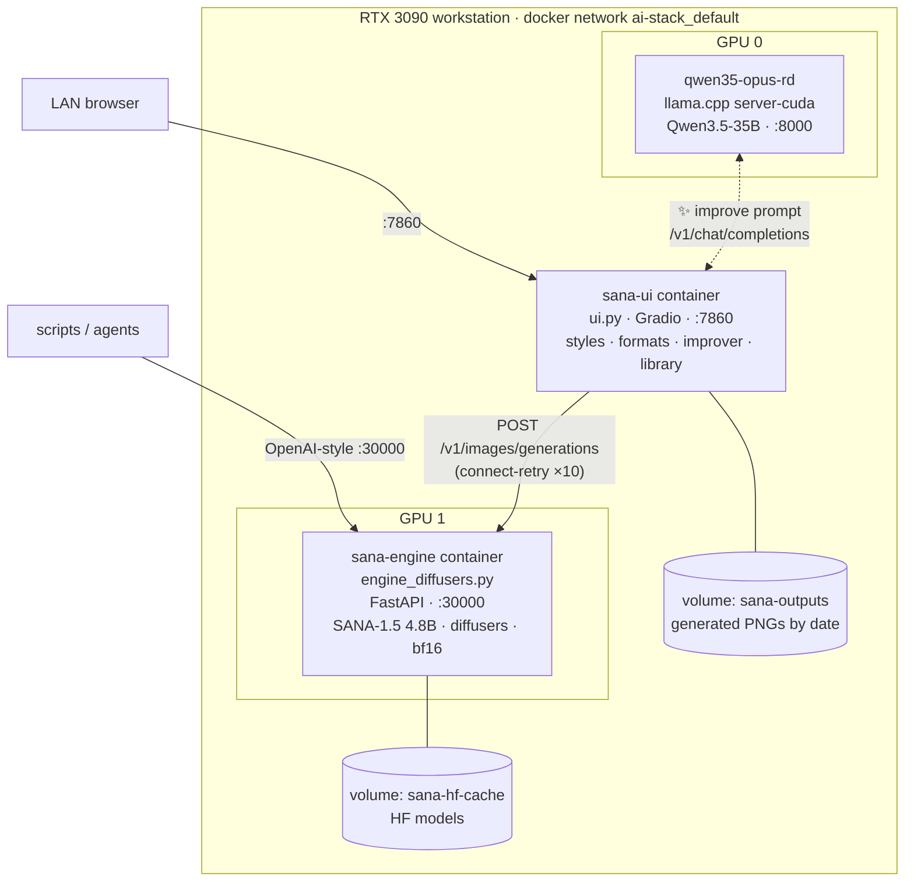
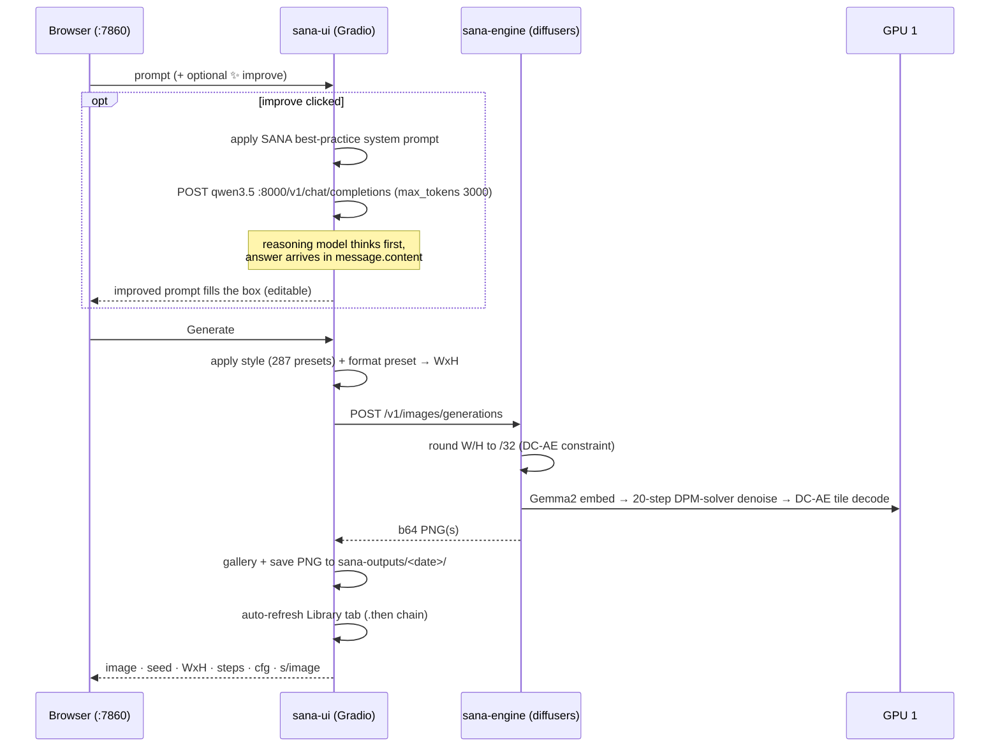
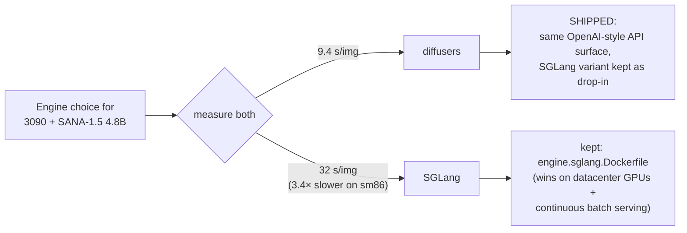

# SANA 3090 Stack

Production text-to-image stack: **SANA-1.5 4.8B** served on a single **RTX 3090 (24 GB)** with a
LAN web UI, an OpenAI-style HTTP API, LLM-powered prompt improvement, 287 style presets,
platform format presets (Instagram / YouTube / web / Kindle), and a browsable image library.

Built and measured on real hardware — every number in this README was verified on the target
box, not quoted from vendor claims.

---

## 1. Hardware target & GPU budget

| Component | Detail |
|---|---|
| GPU | 1× NVIDIA GeForce RTX 3090 — 24 GB GDDR6X (Ampere, sm86) dedicated to SANA (device 1) |
| Second GPU (optional) | Device 0 hosts the Qwen llama.cpp LLM used by the prompt improver |
| Host RAM | 40 GB cgroup cap per service (weights staging during load) |

**GPU 1 residency (steady state, measured):**

| Weights | VRAM |
|---|---|
| SANA-1.5 4.8B DiT (bf16) | 8.79 GB |
| Gemma2 text encoder (bf16) | 4.87 GB |
| DC-AE VAE (fp32 decode, tiled) | 1.16 GB |
| CUDA context + activations + latents | ~1.5 GB |
| **Total steady** | **~16.2 GB of 24 GB** |

Headroom is intentional: it covers 2.6-megapixel generations (Kindle HD 1280×2048) without
spikes — verified flat VRAM across all presets.

---

## 2. Architecture



**Separation of concerns:** the engine owns the GPU and speaks a stable OpenAI-shaped API;
the UI is stateless (rebuilds in seconds, never touches CUDA); the LLM sits on the other GPU.
Either half can be swapped without touching the other — the SGLang engine variant in
`engine.sglang.Dockerfile` is a drop-in replacement (see §7).

### Service map (`docker-compose.yml`)

| Service | Image | Port | GPU | Role |
|---|---|---|---|---|
| `sana-engine` | built from `sana-sglang/engine.Dockerfile` | 30000 | 1 | Diffusion engine, `/v1/images/generations` |
| `sana-ui` | built from `sana-sglang/ui.Dockerfile` | 7860 | — | Gradio web UI |
| `qwen35-opus-rd` | `ghcr.io/ggml-org/llama.cpp:server-cuda` | 8000 | 0 | Prompt-improver LLM (pre-existing service) |

---

## 3. Request flow



---

## 4. The model, and why it is safe to stretch it off-square

**SANA-1.5 4.8B 1024px** (`Efficient-Large-Model/SANA1.5_4.8B_1024px_diffusers`) — the largest
SANA checkpoint, chosen for maximum image quality at ~1 M pixel native budget.

Architecture facts that drive the engineering constraints:

- **DC-AE VAE compresses 32×** → every requested dimension must be a multiple of 32 or decode
  breaks. The engine rounds (`round(w/32)*32`, floor 256); platform-native sizes like
  1080×1920 would crash, so presets snap to 1088×1920 etc.
- **Linear-attention DiT** → token count (hence pixels) scales compute ~linearly, so
  off-square and ~2 M pixel generations stay fast and VRAM-flat (measured).
- **Gemma2 encoder, ~300-token context** → dense 2–3 sentence prompts work best; this is what
  the ✨ improver produces.

### Format presets (all /32-safe, measured end-to-end)

| Preset | Size | Pixels vs native | Notes |
|---|---|---|---|
| Square 1:1 | 1024×1024 | 1.0× | model's home turf |
| Portrait 4:5 | 896×1120 | 1.0× | IG feed |
| Story 9:16 | 576×1024 | 0.6× | fastest |
| Story HD 9:16 | 1088×1920 | 2.1× | verified exact + flat VRAM |
| Landscape 16:9 | 1024×576 | 0.6× | |
| Widescreen 16:9 | 1536×864 | 1.3× | |
| Web banner 21:9 | 1344×576 | 0.8× | |
| Kindle 1:1.6 | 800×1280 | 1.0× | KDP cover ratio, exact |
| Kindle HD 1:1.6 | 1280×2048 | 2.6× | verified 12.8 s/image |

---

## 5. Measured performance (the reason this stack looks like it does)

All numbers measured on this 3090, 1024×1024, 20 steps, CFG 4.5, single request:

| Configuration | s/image | Verdict |
|---|---|---|
| SANA-1 1.6B · diffusers (previous stack) | 3–4 | fast, lower quality ceiling |
| **SANA-1.5 4.8B · diffusers (this stack)** | **9.4–10** | **shipped** |
| SANA-1.5 4.8B · SGLang `dev-cu12`, auto memory policy | 44 | offload-bound |
| SANA-1.5 4.8B · SGLang, `--component-residency text_encoder=resident vae=resident` | 32 | compute-bound |
| SANA-1.5 4.8B · SGLang, `quality:"high"` accelerated path | 32 | no gain on sm86 |



**Why SGLang loses here:** its 1.2–5.9× claims come from kernel/scheduler work tuned for
datacenter GPUs and concurrent batch serving. On an Ampere consumer card with a
linear-attention DiT and one request at a time, diffusers' plain CUDA path is 3.4× faster.
Quality was verified **identical** between engines (CLIP prompt-alignment 1.0 for both).

Quality verification methodology (also used to sanity-check every non-square preset):

- CLIP ViT-B/32 softmax over [correct caption, distractors] → 1.0 for the correct caption on
  every tested generation across both engines and all presets.
- Do **not** trust a single vision tool for acceptance testing — during this build a vision
  utility misreported a solid-red probe image as black and briefly sent debugging down a
  wrong path. Always cross-check with a second, deterministic method.

---

## 6. Feature reference

### Web UI (:7860)

| Feature | Detail |
|---|---|
| 🧹 Clear VRAM | Unloads the model (15.2 GB → 0.3 GB measured); live status line in Advanced; next Generate reloads automatically. |
| 📷 Remix from image | Upload an image → BLIP-large captions it on the engine GPU → caption fills the prompt box. SANA is text-to-image only, so this is the honest image-input path: caption → (optionally ✨ improve) → generate. | Local Qwen3.5-35B rewrites prompts per SANA best practice (concrete visual detail, one scene, no negations, no text-in-image, 2–3 sentences). ~15–30 s. Degrades to a visible error if the LLM is down. |
| Format presets | 9 platform formats (§4). Locked to /32-safe sizes — no way to request a decode-breaking size from the UI. |
| Styles | 10 NVlabs originals + **277 Fooocus styles** (all six official sets). Placeholder styles wrap `{prompt}`; suffix styles append; negative-only enhancers ("Fooocus Enhance") merge negatives only. |
| Optimal settings | 1024 native / 20 steps / CFG 4.5 fixed by default; steps + CFG live in a collapsed Advanced accordion with a one-click Reset to optimal. |
| Seed & batch | Randomize (default) or fixed seed; 1–4 images per run. |
| 📚 Library | Every PNG ever generated, newest first (500 served), date/filename captions, click → lightbox → download. Auto-refreshes after each generation; served from the shared outputs volume so history survives rebuilds. |
| Negative prompt | Unchecked = SGLang-derived tuned default; optional custom box. |

### Engine API (:30000, OpenAI-style)

```bash
curl http://localhost:30000/v1/images/generations \
  -H 'Content-Type: application/json' \
  -d '{"prompt":"a red fox in a snowy forest",
       "negative_prompt":"watermark",
       "size":"1088x1920",        # any WxH; engine rounds to /32
       "n":1,"num_inference_steps":20,"guidance_scale":4.5,
       "seed":42,"response_format":"b64_json"}'
```

`GET /v1/engine/status` → `{state, cuda_allocated_mb, cuda_reserved_mb}` ·
`POST /v1/engine/unload` → drops the pipeline and releases ~15 GB VRAM (measured
15,202 MiB → 266 MiB); the next generation lazily reloads (~20 s warm page cache) ·
`POST /v1/images/caption` (multipart `file`) → BLIP-large caption for image remix
(24 s cold incl. model download, 2.7 s warm; BLIP freed after each call so Clear VRAM
stays true). Health reports `state: idle` after an unload — treated as healthy by design.
`GET /health` → `{status, state: idle|loading|ready|error, loaded_model}` ·
`GET /v1/models` → served model descriptor. Generation is lock-serialized (single GPU,
one pipeline resident).

---

## 7. Operations

```bash
# rebuild + redeploy everything
cd ~/ai-stack && docker compose up -d --build

# rebuild only the UI (engine untouched — note: still restarts it via depends_on)
docker compose up -d --build sana-ui

# tail engine
docker logs -f sana-engine

# swap in the SGLang engine (3.4× slower on a 3090, see §5)
#   compose: sana-engine.build.dockerfile → engine.sglang.Dockerfile
#   + add:  ipc: host / shm_size: 32gb

# change the fixed model (e.g. SANA1.5_1.6B for ~3 s/image)
#   engine_diffusers.py: SANA_MODEL_REPO + ui.py: OPTIMAL/FORMATS if needed
```

**Rollback to the pre-migration multi-model diffusers stack:** the original
`sana/sana_server.py` (8-model hot-swap, PAG, styles) is kept on the host at `~/ai-stack/sana/`
with image `sana-server:latest` still built.

### Files

```
├── docker-compose.yml               # sana-engine + sana-ui (+ llama.cpp LLM service)
└── sana-sglang/
    ├── engine_diffusers.py          # engine: FastAPI + diffusers SANA-1.5 4.8B
    ├── engine.Dockerfile            # engine image (pytorch 2.9.1-cu128 base)
    ├── engine.sglang.Dockerfile     # OPTIONAL SGLang variant (lmsysorg/sglang:dev-cu12)
    ├── ui.py                        # Gradio UI: improver · formats · styles · library
    ├── ui.Dockerfile                # UI image (python:3.12-slim, ~200 MB, no CUDA)
    └── fooocus_styles.json          # 277-style Fooocus pack (swap file to restyle)
```

### Known constraints

- Fooocus negatives use SDXL `(term:1.4)` weight syntax; Gemma2 reads them as plain text —
  directionally effective, weights ignored.
- HD presets (≥1.3× native pixels) render correctly but fine detail softens vs native-budget
  presets. For print-scale Kindle covers, generate 800×1280 and upscale externally.
- First generation after a cold engine start is ~1.4× slower (attention warm-up).
- The ✨ improver needs ~15–30 s because Qwen3.5 reasons before answering; its
  `enable_thinking:false` / `/no_think` switches are ignored by the served chat template, so
  the request budgets 3000 tokens and reads `message.content` (reasoning is separated into
  `reasoning_content` by llama.cpp).
